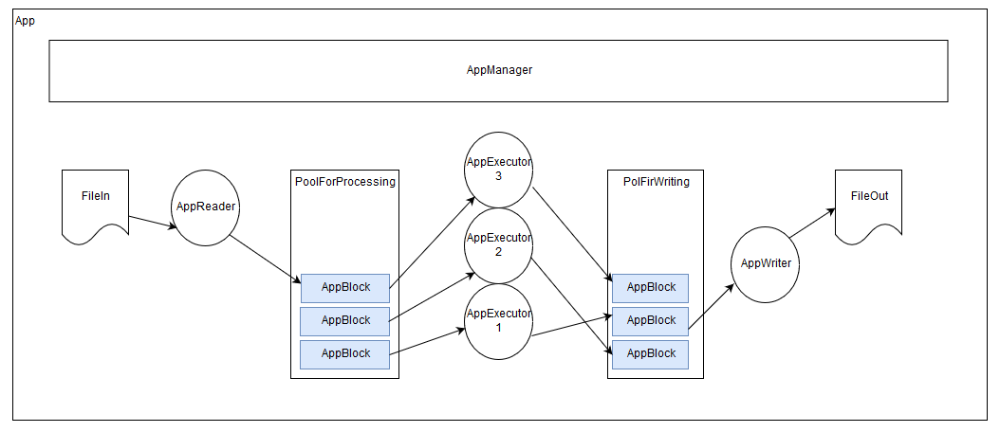

# FileReadWriteThreadsExample

Пример реализации многопоточной обработки файла.

##Постановка задачи
Читать данные из указанного файла блоками. 
Обрабатывать получаемые блоки данных в многопоточном режиме.
Записывать обработанные данные в новый файл.

Приложение должно считывать параметры конфигурации из файла,
путь к которому указывается в нулевом аргуманте при запуске.

#####Файл конфигурации
Файл конфигурации приложения имеет структуру ключ-значение, 
разделенных символом '='. 

#####Свойства, указываемые в файле конфигурации
* путь к входящему файлу;
* путь к файлу куда будут записыватся результаты;
* количество обработчиков блоков;
* размер блока чтения и записи файла

Поддержать форматы следующие форматы наименования файлов конфигурации:
* `*.properties`
* `*.txt` 

#####Источники
Источниками для данной постановки послужили задачи с сайта [stackoverflow](https://ru.stackoverflow.com):
* [Вернуть поток в начальное положение](https://ru.stackoverflow.com/questions/1062051/%d0%92%d0%b5%d1%80%d0%bd%d1%83%d1%82%d1%8c-%d0%bf%d0%be%d1%82%d0%be%d0%ba-%d0%b2-%d0%bd%d0%b0%d1%87%d0%b0%d0%bb%d1%8c%d0%bd%d0%be%d0%b5-%d0%bf%d0%be%d0%bb%d0%be%d0%b6%d0%b5%d0%bd%d0%b8%d0%b5)
* [Java: согласование thread'ов](https://ru.stackoverflow.com/questions/1065846/java-%d1%81%d0%be%d0%b3%d0%bb%d0%b0%d1%81%d0%be%d0%b2%d0%b0%d0%bd%d0%b8%d0%b5-thread%d0%be%d0%b2?noredirect=1#comment1827070_1065846)

и ссылка на [описание](https://github.com/kystyn/java/tree/master/pipeline)

##Решение
#####Схема

#####Описание
* **FileIn** - файл с входящей информацией

* **FileOut** - файл создаваемый в результате работы программы

* **AppBlock** - блок чтения информации, хранит в себе прочитанную информацию 
в массиве байт и номер - под которым был прочитан данный фрагмент из файла.
По номеру блока писатель `AppWriter` определяет в какой последовательности 
записывать блоки в итоговый файл.

* **PoolForProcessing** - коллекция блоков файлов на обработку. 
Работает по принципу FIFO, выдает следующий блок по запросу обработчика
`AppExecutor`.

* **PoolForWriting** - коллекция блоков файлов на запись в итоговый файл.

* **AppReader** - поток чтения файла. Читает файл `FileIn` блоками `AppBlock` 
и помещает прочитанный блок в  `PoolForProcessing`.

* **AppExecutor** - потоки обработки блоков информации из `PoolForWriting`, 
после завершении обработки складывает блоки в `PoolForWriting`.

* **AppWriter** - поток записи в итоговый файл. Хранит номер следующего блока 
для записи. Запрашивает из `PoolForWriting` блок по номеру следующего блока.

* **AppManager** - поток управления. В задачи которого входит инициализировать
коллекции (`PoolForProcessing` и `PoolForWriting`) через которые потоки 
обмениваются блоками информации, инициализация запуск и остановка потоков: 
`AppReader`,`AppWriter`.

####Конфигурирование

* **filePathIn** - путь к входящему файлу. 
Если путь не указан или указанного файла не существует, а также
если к существующему файлу нет доступа на чтение файла, приложение 
останавливается с кодом ошибки -1.

* **filePathOut** - путь к файлу куда будут записыватся результаты.
Если путь не указан или указанный файл уже существует, а также
если нет доступа для создания файла, приложение 
останавливается с кодом ошибки -1.

* **countExecutors** - количество обработчиков блоков. 
Может принимать значение потоков от 1 до 10. 
В любых других случаях приложение применяет значение 
по умолчанию равное 1.

* **blockSize** - размер блока чтения/записи.
Может принимать значения от 20 до 200.
В любых других случаях приложение применяет значение 
по умолчанию равное 50.